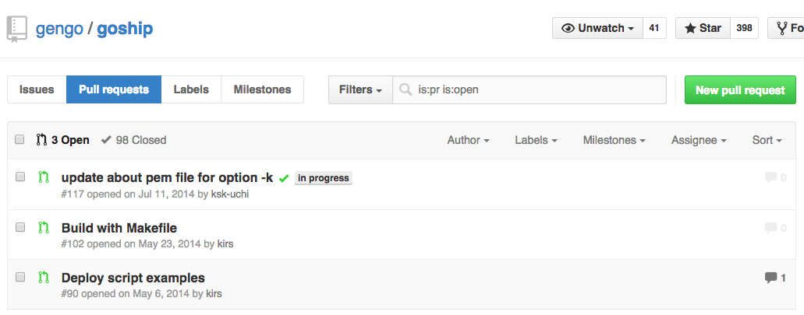

# 1. First Impression

Every pull request (PR) has a purpose, whether it is to fix a bug, or to update some features. 

Collaborators login to Github and are greeted with a list of PRs ready for review.

Just from those titles alone, could you figure out what each PR is about?

`Deploy script examples` is a pretty sweet title. Short, simple and quite straightforward. You know this PR probably updates the README and provide some code examples for deploying.

Great!

Perhaps, we can do even better. How about `Add deploy script examples` ? 

Now we're talking. A good PR title should just be short and straightforward. In short,

> **Keep a pull request title within 10 words, brother**

Some keywords I like to use:

- `Update [blah blah blah]` : for feature updates
- `Use [blah blah] instead`: when we switch libraries, etc.
- `Fix [blah blah] in ...`: great! a bug fix!

## Use the labels, Luke

Also, we can make good use of **labels** on Github. 

As these labels appear besides the title of each PR, make good use of labels to further categorize, identify which part of the code this PR is about.

Labels are great for categorization as well as for quick visual lookups!

